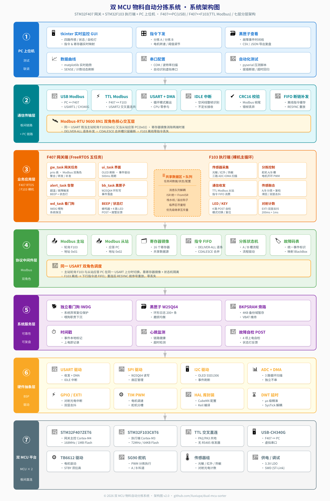
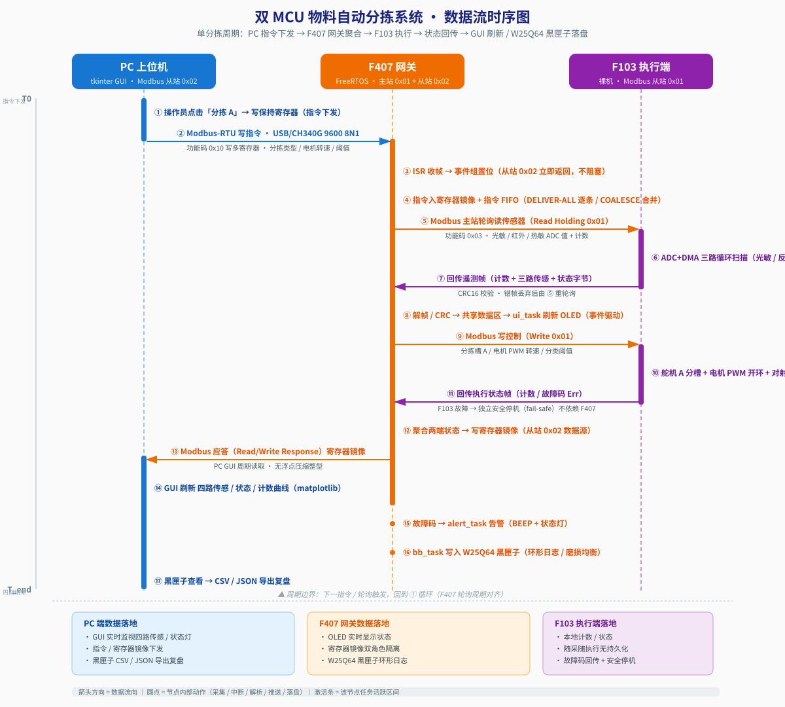

# 双 MCU 物料自动分拣系统

基于 STM32F407 + FreeRTOS + Modbus RTU + 舵机的工业级物料自动分拣原型：F407 协议网关 + F103 执行/传感端 + PC 上位机实时监控，可作为嵌入式 / 工业通信方向简历项目。

## 目录

- [项目简介](#项目简介)
- [系统架构](#系统架构)
- [数据流时序](#数据流时序)
- [硬件环境](#硬件环境)
- [软件特性](#软件特性)
- [FreeRTOS 任务划分](#freertos-任务划分)
- [遇到的问题与解决方案](#遇到的问题与解决方案)
- [目录结构](#目录结构)
- [编译与烧录指南](#编译与烧录指南)
- [开源协议](#开源协议)

## 项目简介

系统由 F407 协议网关 与 F103 执行/传感端 两部分组成:

- **F407 网关**: 周期轮询 F103 寄存器 → 镜像至本地寄存器映射 → 应答 PC Modbus 轮询; 同时承担**主站**(对 F103)与**从站**(对 PC)双重身份; OLED 本地显示状态, KEY 翻页; 黑匣子异步落盘到 W25Q64。
- **F103 执行端**: 周期性扫描三路 ADC(光敏/反射/热敏)与一对对射 EXTI → 物料分类 → 舵机分拣 → 电机 PWM 调速; 全部数据通过 Modbus RTU 上送给 F407 镜像; 故障时独立安全停机(fail-safe), 不依赖 F407。
- **PC 上位机(tkinter + matplotlib)**: USB 串口(Modbus RTU)连接 F407 → 实时面板查看寄存器/状态灯/SENSE 曲线 → 下发分拣/启停/复位指令; 支持黑匣子 CSV/JSON 导出。

三层通信全部为 **Modbus RTU 半双工 9600 8N1**, 无 LWIP/以太网。

## 系统架构



> 七层分层架构: PC 上位机 → 通信传输 → 业务应用 (F407 RTOS / F103 裸机) → 协议中间件 (Modbus 双角色) → 系统服务 (IWDG + 黑匣子 + BKPSRAM 旁路) → 硬件抽象 (BSP) → 双 MCU 平台。详见 [`docs/架构图.svg`](docs/架构图.svg) 与 [`docs/数据流时序图.svg`](docs/数据流时序图.svg)。

## 数据流时序



> 单分拣周期端到端时序: PC 指令下发(Modbus 从站 0x02) → F407 网关聚合(主站 0x01 轮询 F103 + 寄存器镜像 + FIFO 补发) → F103 执行(ADC+DMA / 舵机分拣 / 对射计数) → 状态回传 → GUI 刷新 / W25Q64 黑匣子落盘。矢量图见 [`docs/数据流时序图.svg`](docs/数据流时序图.svg)。

## 硬件环境

- **主控芯片**: STM32F407ZET6 (Cortex-M4, 192 KB SRAM, 1 MB Flash) × 1, STM32F103C8T6 (Cortex-M3, 20 KB SRAM, 64 KB Flash) × 1
- **网关外设**:
    - CH340G USB-TTL (USART1 ↔ USB, 上位机通讯)
    - 0.96" SSD1306 OLED (I2C, PB8/PB9, 地址 0x3C, 本地状态显示)
    - W25Q64 SPI Flash (黑匣子持久化)
    - TIM13 BEEP 报警
    - USART3 (PB10/11) ↔ F103 USART2 (PA2/3) 交叉直连, 共 GND
- **执行端外设**:
    - TB6612 电机驱动 (AIN1/AIN2=PB3/PB4, STBY 必须拉高), PA8 TIM1 PWM (电机调速)
    - SG90 舵机 (PA6 TIM3, 0° / 90° / 150° = 回中 / A 料道 / B 料道)
    - 光敏电阻 LDR (PB0 ADC, 物料分类依据)
    - 反射红外对管 (PB1 ADC, 分拣复检)
    - NTC 热敏电阻 (PA4 ADC, 超温滞回停机)
    - 对射光电 (PA12 EXTI 下降沿, 物料计数)

## 软件特性

- **实时监控**: PC 上位机(tkinter)与网关 OLED 双端实时显示寄存器/状态/传感曲线; SENSE 历史曲线 matplotlib 重绘
- **断链补发**: 网关下行指令采用 FIFO 队列(控制类 DELIVER-ALL / 分拣目标 PWM 类 COALESCE-最新), F103 离线时指令不丢, 插回线自动补发重放
- **超时监测**: PC 串口无应答 >1s 判定掉线 → BEEP + LED0 报警; F103 静默 >2s → 独立安全停机(fail-safe)
- **故障自复**: IWDG 复位前 BKPSRAM 旁路落盘最近事件 → 重启后由 `GW_Poll` 迁移进 W25Q64 黑匣子(原子写 <1 µs, 硬复位不丢)
- **传感融合**: 光敏 A/B 料道分类 + 反射红外复检 + 对射 EXTI 双层去抖(上电 1s 宽限 + 500 ms 重触发抑制) + 热敏超温滞回
- **掉电持久**: W25Q64 环形记录故障事件(事件码 + RTC 时间戳), 重启或断电均不丢

## FreeRTOS 任务划分

F407 网关运行 FreeRTOS (CMSIS_V2), 5 个应用任务 + 1 个 CubeMX 占位:

| 任务 | 优先级 | 职责 |
|------|--------|------|
| `GW_Task` | 高 (osPriorityHigh) | 网关核心: ISR `xQueueSendFromISR` 入字节队列 → 主站轮询 F103 + 从站应答 PC + 数据镜像 + LED 指示; 20 ms 周期 |
| `UI_Task` | 低 (osPriorityLow) | OLED 渲染 + KEY 扫描, 内部 200 ms 节流, 慢 I2C 不抢 gw 时间 |
| `Alert_Task` | 中 (osPriorityNormal) | BEEP 蜂鸣 + LED0 报警; 监听 PC 掉线 / F103 故障事件 |
| `BB_Task` | — | 故障黑匣子异步持久化到 W25Q64(事件码 + 时间戳) |
| `WD_Task` | 最低 (osPriorityIdle) | 系统服务层看门狗: 每秒巡检 4 业务任务心跳, 独占 IWDG 喂狗 |
| `defaultTask` | Normal | CubeMX 占位空转任务 |

队列: `g_q_rx`(ISR → gw_task 字节) / `g_q_ev`(gw → alert_task 事件) / `g_q_bb`(gw → bb_task 事件)。

F103 端为裸机主循环 + DMA + EXTI, 不上 RTOS(节省 20 KB RAM, 业务足够简单)。

## 遇到的问题与解决方案

1. **看门狗事件落盘丢失**: IWDG 复位会打断 W25Q64 写 → 改用 **BKPSRAM 备份域旁路**(原子写 < 1 µs, 复位不丢), 重启后由 `GW_Poll` 迁移进黑匣子
2. **三路 ADC 同步采样全同值**: 单次扫描模式三个通道分时复用 SAMPLEN → 改用 `DMA1_Ch1 circular` + 每个通道单独 `ConfigChannel`, 由 `HAL_ADC_ConvCpltCallback` 搬走整组数据
3. **PC 串口写偶发阻塞 3-12 s**: Windows + pyserial + CH340 下 `ser.write()` 阻塞, 拉 PC 超时不可行 → 固件端 **1 s 稳定确认** 瞬态抑制根治
4. **Modbus 单寄存器溢出**: DELIVER-ALL 类(控制/分拣指令)改用 `s_cmd_fifo` 逐条补发, COALESCE 类(目标 PWM)用合并槽只留最新
5. **GUI 状态灯语义**: 排查确认 SYS_STATUS 文本与状态灯本就一致; 把物理串口连接灯标签改为"串口连接"以区分"PC 掉线"语义

## 目录结构

```
.
├── README.md           ← 仓库首页(本文件,项目包装)
├── LICENSE             ← MIT 开源协议
├── .gitignore          ← 排除 Keil 构建产物 / .workbuddy / pycache 等
├── docs/               ← 架构图 + 数据流时序图
│   ├── 架构图.svg      ← 7 层系统架构(矢量,无损缩放)
│   ├── 架构图.png      ← 同上(嵌入 README/PPT 用)
│   ├── 数据流时序图.svg← 单分拣周期端到端时序(矢量)
│   └── 数据流时序图.png← 同上(嵌入 README/PPT 用)
├── f407_gateway/       ← STM32F407 网关固件 (Modbus 主从 + FreeRTOS 五任务)
├── f103_executor/      ← STM32F103 执行端固件 (ADC+DMA / 传感融合 / 舵机分拣)
└── pc_tools/           ← PC 上位机(GUI/实时监控/探针脚本)
    ├── sorter_gui.py   ← tkinter 主界面 + matplotlib 曲线
    ├── live_view.py    ← 命令行实时查看
    ├── regmap_defs.py  ← PC 端寄存器真源
    └── run_gui.bat     ← Windows 一键启动
```

> 完整固件工程(f407_gateway / f103_executor)的文件树见各工程目录(`f407_gateway/`、`f103_executor/`)下的 `MDK-ARM/*.uvprojx` 与源码树。

## 编译与烧录指南

### F407 网关
1. Keil 打开 `f407_gateway/MDK-ARM/*.uvprojx`
2. `Project → Rebuild all target files`(勿用 F7 增量)
3. `F8` 下载, 确认输出 `Verify OK`
4. CubeMX 重新 Generate 后需检查 `USER CODE BEGIN` 是否调用 `APP_MAIN_Init()/Run()`, 并 grep `stm32f4xx_it.c` 防 USART IRQ 重复定义

### F103 执行端
1. Keil 打开 `f103_executor/MDK-ARM/*.uvprojx`
2. `Rebuild all` → `0 Error(s)` → `F8` `Verify OK` → 烧录
3. 串口调试(printf)走 `USART1` → USB-TTL(COM11)

### 烧录铁律(踩坑总结)
> **改任何 .c/.h 后**: `F7 Rebuild` → Build Output `0 Error` → `F8 Load` → `Verify OK`。缺一步 Flash 里就是旧代码。

### 上位机
- 依赖: `pyserial`, `matplotlib`(GUI 曲线)
- 双击 `pc_tools/run_gui.bat` 启动, 或命令行 `python pc_tools/sorter_gui.py`

## 开源协议

MIT License — 详见 [LICENSE](LICENSE)。

---

📖 **想看完整手册**(架构图、数据流时序、BOM、引脚表、完整寄存器映射、FreeRTOS 设计细节、调试案例、已知限制)?请查看 [`docs/架构图.svg`](docs/架构图.svg)、[`docs/数据流时序图.svg`](docs/数据流时序图.svg)，以及 `f407_gateway/`、`f103_executor/` 内的源码与 CubeMX 配置。
